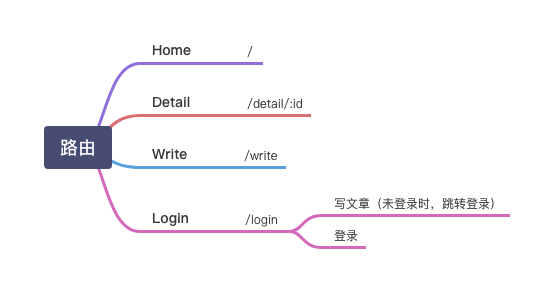

# react 仿简书项目

## 项目结构

```js
src/common; // 公共组件
src/pages; // 页面
src/static; // 静态资源
src/store; // 主 store
App.js; // 根组件
index.css; // 样式
index.js; // 入口文件
```

## 重置 css

搜索`reset.css`，复制过来

## `styled-components`

`css`文件一旦在一个文件中被引入，会在全局中生效

这样写`css`会有些问题，当页面中有多个组件时，样式存在被覆盖的风险

我们希望在写样式的时候，每个组件的样式是独立的，不会互相的影响

### 使用

1. 将`index.css`重命名为`style.js`
2. 在`index.js`引入`style.js`
   ```js
   import "style.js";
   ```
3. `style.js`

   ```js
   import { injectGlobal } from "styled-components";

   injectGlobal`
     body{
       padding: 10px
     }
   `;
   ```

### 在组件中使用

#### 组件声明

```js
// Header/style.js
import styled from "styled-components";

export const HeaderWrapper = styled.div`
  height: 56px;
`;

// Header/index.js
import { HeaderWrapper } from "./style";

class Header extends Component {
  render() {
    return <HeaderWrapper></HeaderWrapper>;
  }
}
```

#### 图片使用

在`style.js`中使用背景图片的话，直接使用`background: url('/images/logo.png')`是没有效果的，因为`webpack`在打包的时候，不知道工程目录是啥样的，它会把路径当成字符串

需要这样写

```js
import logoPic from "/images/logo.png";

export const Logo = style.a`
  background: url(${logoPic})
`;
```

#### 设置属性

```js
import logoPic from "/images/logo.png";

export const Logo = style.a.attr({
  href: "/",
})`
  background: url(${logoPic})
`;
```

#### 参数传递

组件中要传递不同的参数进来，`styled`提供了函数功能

```js
<RecommendItem key='1' imgURL='/images/1.png'>1</RecommendItem>
<RecommendItem key='2' imgURL='/images/2.png'>1</RecommendItem>

// style.js
export const RecommendItem = styled.div`
  width: 280px;
  height: 50px;
  background: url(${props => props.imgURL});
  background-size: contain;
`
```

## immutable.js

在`reducer`中，`state`的数据是不希望被改变的，在写项目的时候，很容易在不知不觉中把`state`给改了，从而造成异常。

`immutable.js`可以帮助解决问题，它会生成一个`immutable`对象，这个对象是不可被改变的。

`immutable`提供了`fromJS`的方法，可以把`js`对象转换成`immutable`对象

```js
const a = fromJS({ age: 18 });
```

`immutable`提供了`get`和`getIn`两种方法来读取数据

```js
const a = fromJS({
  age: 18
  feature: {
    height: 180
  }
})

const age = a.get('age')

const height = a.getIn(['feature', 'height'])
// 或者
const height = a.get('feature').get('height')
```

`immutable`提供了`set`和`merge`两种方法来设置数据。

`immutable`对象的`set`方法，会结合之前的`immutable`对象的值，和设置的值，返回一个全新的对象。它并不会去改之前的`immutable`数据。

```js
const a = fromJS({
  age: 18,
  name: "uccs",
});
a.set("age", 19).set("name", "tiantain");
// 或者
a.merge({
  age: 1,
  name: "tiantian",
});
```

当最外面使用`immutable`对象时，内部的`Object`类型的数据也会变成`immutable`类型，所以在使用`set`设置时，先要把普通对象变成`immutable`对象才行。

```js
const a = fromJS({
  list: [], // 这个 list 也是 immutable 数组
});

const data = [1, 2, 3];
a.set("list", fromJS(data));
```

`immutable.js`提供了`toJS`方法，是为了将`immutable`对象转换成`js`对象

```js
const a = fromJS({
  list: [1, 2, 3],
});

const b = a.toJS();
b[1];
```

## redux-thunk

`redux-thunk`的作用是可以在`action`中写函数

## redux

首页需要安装`redux`和`react-redux`

`react-redux`是方便在`react`中使用`redux`

`redux`的使用可以看：[redux 学习笔记](https://github.com/astak16/growth-record/blob/master/%E5%AD%A6%E4%B9%A0%E7%AC%94%E8%AE%B0/React/Redux.md)

### store/index.js

```js
// store/index.js
import { createStore, applyMiddleware, compose } from "redux";
import thunk from "redux-thunk";
import reducer from "./reducer";

const store = createStore(reducer, compose(applyMiddleware(thunk))); // 在 store 中使用 redux-thunk

export default store;
```

### store/reducer.js

```js
// 主 store/reducer.js
import { combineReducers } from "redux-immutable";
import { headerReducer } from "../common/header/store";

export default combineReducers({
  header: headerReducer,
});

// 分 header/store/reducer.js
import { Search_Focus } from "./actionType";
import { fromJS } from "immutable";
const defaultState = fromJS({
  focused: false, // 默认数据
});
export default (state = defaultState, action) => {
  switch (action.type) {
    case Search_Focus:
      return state.set("focused", action.data);
    default:
      return state;
  }
};
```

`redux-immutable`提供了一个`combineReducers`方法，这个方法用来组合各个拆分出来的`reducer`。

### header/store/actionCreators.js

```js
// header/store/actionCreators.js
import {Search_Focus} from './actionType'

const searchFocus = (data) => {
  type: Search_Focus,
  data
}

export const getList = async () => {
  return (dispatch) => {
    const res = await axios.get('api/header.json')
    dispatch(searchFocus(res.data))
  }
}
```

### header/store/actionType.js

```js
// header/store/actionType.js
export const Search_Focus = "header/search_focus";
```

### App.js

```js
// App.js
import { Provider } from "react-redux";
import store from "./store";

<Provider store={store}>
  <BrowserRouter>
    <div>
      <Header />
    </div>
  </BrowserRouter>
</Provider>;
```

`react-redux`有一个核心组件`Provider`，这个组件有一个`store`属性，将我们定义的`store`传给它，这样`Provider`里面所有组件都有能力去使用`store`中的数据了

### 组件连接 store

`Provider`把`store`提供给了各组件，但是组件想使用`store`中的数据，还要做连接

```js
import { connect } from "react-redux";

class Header extends React.Component {}

export default connect()(Header);
```

`react-redux`提供了`connect`方法，`connect`就是帮助组件和`store`建立连接的。
`connect`接收两个参数：`mapStateToProps`和`mapDispatchToProps`

```js
import { actionCreators } from "./store/actionCreators";

const mapStateToProps = (state) => {
  return {
    focused: state.getIn(["header", "focused"]),
  };
};

const mapDispatchToProps = (dispatch) => {
  return {
    handleInputFocus() {
      dispatch(actionCreators.getList());
    },
  };
};
export default connect(mapStateToProps, mapDispatchToProps)(Header);
```

组件中使用`this.props.focused`

## react-router-dom

`Route`

- `render`方法可以渲染一个东西
- `exact`完全匹配路径
  - `exact`为`false`时，`/`和`/detail`都能匹配上
- `component`渲染组件

```js
import { BrowserRouter, Route } from "react-router-dom";
import Home from "./pages/home";
import Detail from "./pages/detail/loadable";

function App() {
  return (
    <Provider store={store}>
      <BrowserRouter>
        <div>
          <Route path="/" exact component={Home} />
          <Route path="/detail/:id" exact component={Detail} />
        </div>
      </BrowserRouter>
    </Provider>
  );
}

export default App;
```

## 动画

换一换旁边有个`icon`，每次点击的时候，这个`icon`需要转动起来。

每次点击的时候只要改变`icon`的`trannform: rotate()` 的值就可以了。每次增加 360°

通过`ref`可以获取到`react`渲染出来的真实节点。

```js
<SearchInfoSwitch onClick={() => handleChangePage(this.spinIcon)}>
  <i className='iconfont spin'
     ref={icon => this.spinIcon = icon}
  >&#xe852;</i>
换一批</SearchInfoSwitch>

handleChangePage(spin) {
  let originAngle = spin.style.transform.replace(/[^0-9]/ig, '')
  if (originAngle)
    originAngle = parseInt(originAngle, 10)
  else
    originAngle = 0

  spin.style.transform = `rotate(${originAngle + 360}deg)`
}
```

## 其他

1. 用`Link`代替`a`做跳转，可以做到按需加载
2. `PureComponent`组件等价于`Component`+`shouldComponentUpdate`
3. `dangerouslySetInnerHTML={{__html: '<div>文本</div>'}}`可以渲染`HTML`内容
4. `<Route path='/detail/:id'/>`路由参数获取`this.props.match.params.id`
5. 异步组件`redux-immutable`，使用异步组件时需要用`withRouter`，`export default connect(mapState, mapDispatch)(withRouter(Detail));`

   ```js
   // detail/loadable.js
   import React from "react";
   import Loadable from "react-loadable";

   const LoadableComponent = Loadable({
     loader: () => import("./"),
     loading() {
       return <div>正在加载</div>;
     },
   });

   export default () => <LoadableComponent />;

   // App.js
   import Detail from "./pages/detail/loadable";
   ```

## 总结

### 路由



### 项目技术栈：

- `react-router`：路由
- `react-redux`：数据挂你工具
- `react-loadable`： 按需加载
- `react-transition-group`：动画
- `redux-immutable`：将`state`变成`immutable`对象
- `redux-thunk`：可以在`action`中使用函数
- `styled-components`：局部样式
- `axios`：`ajax`请求
