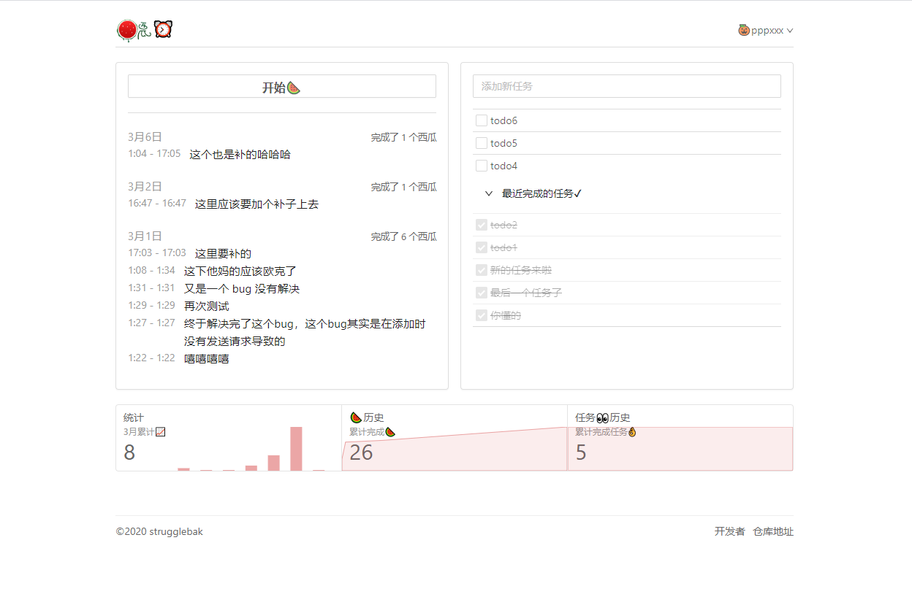

# watermelon-clock

<div class="watermelon-clock-logo" style="display: flex; justify-content: center;">
  
</div>

> 这是一个🍉闹钟，可以随时用来记录你的个人计划和生活琐事哦~

> ⚠: 目前可测试账号跟密码为 `pppxxx`/`pppxxx`，有意者可以先进入页面登陆然后就可以进行预览了

> 📢 [项目相关博客地址可点击这个链接](https://strugglebak.github.io/2020/03/17/watermelon-clock-%E5%9F%BA%E4%BA%8ETypeScript-React%E7%9A%84%E8%A5%BF%E7%93%9C%E9%97%B9%E9%92%9F%E9%A1%B9%E7%9B%AE%E7%9A%84%E5%AE%9E%E8%B7%B5%E6%80%BB%E7%BB%93/)

> 🤣 [项目预览可点击这个链接哦~](https://strugglebak.github.io/watermelon-clock/)

## 预览

### 整体页面



### 统计组件


### 西瓜历史组件


### 任务历史组件


### 可补充西瓜组件


## 主要技术栈

- React 16.12
- Antd 4.0.1
- Axios 库
- React-Router-Dom 5.1.2
- React-Redux 7.1.3
- Redux 4.0.5
- TypeScript 3.8.3
- History 4.10.1
- Lodash 4.14

## 安装

### 使用 yarn

```bash
yarn install
```

### 使用 npm

```bash
npm i -D
```

由于是使用 `create-react-app` 生成的项目，在运行命令之前可参考 `package.json` 中的 `scripts` 选项

```json
"scripts": {
  "predeploy": "yarn build",
  "deploy": "npx gh-pages -d build",
  "start": "react-app-rewired start",
  "build": "react-app-rewired build",
  "test": "react-app-rewired test",
  "eject": "react-scripts eject"
}
```

### 项目运行

```bash
yarn start
```

### 项目 build

```bash
yarn build
```

### 项目打包和部署

```bash
yarn run deploy
```

## 协议

[MIT](./LICENSE)
