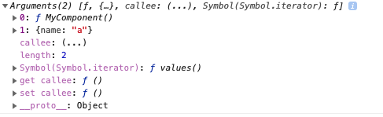
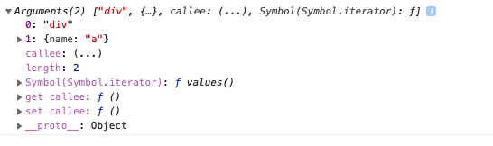
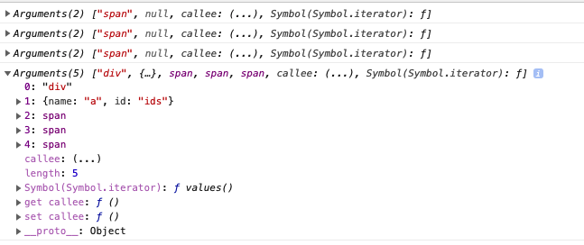
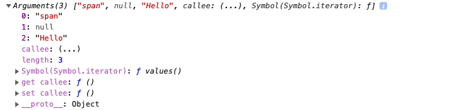

# ToyReact

## webpack 配置

- `optimization: { minimize: false}` ：打包后的会把每一个文件放在 `eval` 中执行，通过 `sourceURL` 的方式在浏览器中打开它的时候变成一个单独的文件

  ```jsx
  eval('console.log("1");\n\n//# sourceURL=webpack:///./main.js?');
  ```

- `@babel/preset-env` 把高版本的 `es` 语法翻译成低版本的 `es` 语法
- `@babel/plugin-transform-react-jsx` 在 `js` 中可以使用 `jsx` 语法

  ```jsx
  let a = <MyComponent name="a" />;
  // 被翻译成
  var a = createElement(MyComponent, {
    name: "a",
  });
  ```

- `pragma` ：文本替换，如果不加的话默认是 `React.crateElement` ，这里要自己实现一个 `React` 所以这里要替换成 `ToyReact.createElement`

```jsx
module.exports = {
  entry: {
    main: "./main.js",
  },
  mode: "development",
  optimization: {
    minimize: false,
  },
  module: {
    rules: [
      {
        test: /\.js$/,
        use: {
          loader: "babel-loader",
          options: {
            presets: ["@babel/preset-env"],
            plugins: [
              [
                "@babel/plugin-transform-react-jsx",
                { pragma: "ToyReact.createElement" },
              ],
            ],
          },
        },
      },
    ],
  },
};
```

## ToyReact 基本使用方法

[源码](https://github.com/astak16/actual-project/tree/ToyReact-core/react/toy-react)

`main.js` 是项目的入口文件，引入 `ToyReact` ，声明一个组件 `MyComponent`

```jsx
// main.js
import { ToyReact } from "ToyReact";

class MyComponent {}

let a = <MyComponent name="a" />;
```

`ToyReact.js` 是核心代码，这样就形成了一个最简单的 `react` 。

```jsx
// ToyReact.js
export let ToyReact = {
  createElement() {
    console.log(arguments);
  },
};
```

`createElement` 有两个参数：

- `type`：组件名 `MyComponent` （上图）
  - 如果 `jsx` 标签是**小写**的，那么这里的第一个参数是个**字符串**不是变量（下图图）
- `attribute` ：组件上的属性





## 用 ToyReact 实现 dom

### 创建 dom 节点

```jsx
// main.js
import { ToyReact } from "ToyReact";

let a = (
  <div name="a" id="ids">
    <span></span>
    <span></span>
    <span></span>
  </div>
);
```

`createElement` 需要返回一个 `dom` 元素，否则最后的 `div` 接收到的 `children` 都是 `null`

```jsx
// ToyReact.js
export let ToyReact = {
  createElement(type, attributes, ...children) {
    console.log(arguments);
    return document.createElement(type);
  },
};
```

前三次创建了三个 `span` ，第四次就把这三个 `span` 作为 `children` 传递进来。

所以这时候

- `type` 就是 `div`
- `attribute` 就是 `name` 和 `id`
- `children` 就是三个 `span`



### 挂载 dom 节点

```jsx
// main.js
import { ToyReact } from "ToyReact";

let a = (
  <div name="a" id="ids">
    <span>Hello </span>
    <span>ToyReact </span>
    <span>！！！</span>
  </div>
);

document.body.appendChild(a);
```

`span` 里面的文本节点，传递进来后变成了一个字符串，所以在 `appendChild` 时需要创建一个文本节点。（下图）

```jsx
// ToyReact.js
export let ToyReact = {
  createElement(type, attributes, ...children) {
    let element = document.createElement(type);

    for (let name in attributes) {
      element.setAttribute(name, attributes[name]);
    }

    for (let child of children) {
      if (typeof child === "string") child = document.createTextNode(child);
      element.appendChild(child);
    }
    return element;
  },
};
```



### 实现 ToyReact.render

在 `react` 中，挂载节点不是直接使用 `document.body.appendChild` 而是使用了 `render` 的方法，它为什么要这样做呢？主要原因是 `jsx` 是一个混合内容，组件和 `HTML` 是并存的，如果不是 `HTML` 的元素的话，无法使用 `document.body.appendChild` 。

```jsx
// main.js
import { ToyReact, Component } from "ToyReact";

class MyComponent extends Component {
  render() {
    return <div>cool</div>;
  }
}

let a = <MyComponent name="a" id="ids"></MyComponent>;

ToyReact.render(a, document.body);
```

这里面给 `document.createElement` 包裹一层 `wrapper` ，把创建 `dom` 的过程统一操作。这里的 `Wrapper` 分为 `ElementWrapper` 和 `TextWrapper` ， `ElementWrapper` 用于创建元素节点， `TextWrapper` 用于创建文本节点。

`ElementWrapper` 的 `appendChild` 接收的参数是虚拟 `dom` 。

同时抽象出 `Component` ，实现 `mountTo` 和 `setAttribute` 方法，让 `MyComponent` 继承 。

```jsx
class ElementWrapper {
  constructor(type) {
    this.root = document.createElement(type);
  }

  setAttribute(name, value) {
    this.root.setAttribute(name, value);
  }

  appendChild(vchild) {
    vchild.mountTo(this.root);
  }

  mountTo(parent) {
    parent.appendChild(this.root);
  }
}

class TextWrapper {
  constructor(content) {
    this.root = document.createTextNode(content);
  }

  mountTo(parent) {
    parent.appendChild(this.root);
  }
}

export class Component {
  constructor() {
    this.children = [];
  }

  setAttribute(name, value) {
    this[name] = value;
  }

  mountTo(parent) {
    let vdom = this.render();
    vdom.mountTo(parent);
  }

  appendChild(vchild) {
    this.children.push(vchild);
  }
}

export let ToyReact = {
  createElement(type, attributes, ...children) {
    let element;
    if (typeof type === "string") element = new ElementWrapper(type);
    else element = new type();

    for (let name in attributes) {
      element.setAttribute(name, attributes[name]);
    }

    if (typeof child === "string") child = new TextWrapper(child);
    element.appendChild(child);

    return element;
  },
  render(vdom, element) {
    vdom.mountTo(element);
  },
};
```

### 自动展开 children

写到这里的时候，会有一个问题，这里面的 `this.children` 不会自动展开，而不是把这东西当成一个 `child` 来看

```jsx
class MyComponent extends Component {
  render() {
    return (
      <div>
        <span>Hello</span>
        <span>Hello</span>
        <div>{this.children}</div>
      </div>
    );
  }
}
```

在 `mountTo` 时接收到的是一个数组，我们是希望把数组展开，实现一个 `inseartChildren`

```jsx
createElement(type, attributes, ...children) {
  let element
  if (typeof type === 'string')
    element = new ElementWrapper(type)
  else
    element = new type

  for (let name in attributes) {
    element.setAttribute(name, attributes[name])
  }

  let insertChildren = (children) => {
    for (let child of children) {
      if (typeof child === 'object' && child instanceof Array) {
        insertChildren(child)
      } else {
        if (!(child instanceof Component) &&
          !(child instanceof ElementWrapper) &&
          !(child instanceof TextWrapper))
          child = String(child)

        if (typeof child === 'string')
          child = new TextWrapper(child)
        element.appendChild(child)
      }
    }
  }

  insertChildren(children)

  return element
}
```

## 实现 setState，props，事件

[源码](https://github.com/astak16/actual-project/tree/ToyReact-lifecycle/react/toy-react)

单次渲染，已经完成了，但肯定不能一次渲染，后面再也不去动它了，可能需要通过某种方式去重新渲染。

这里的 `main.js` 就相对复杂了，本来这个例子是教我们如何把 `react` 跑起来，现在我们反过来，用这个例子去验证框架支不支持

```jsx
// mian.js
import { ToyReact, Component } from "./ToyReact";

class Square extends Component {
  constructor(props) {
    super(props);
    this.state = {
      value: null,
    };
  }

  render() {
    return (
      <button className="square" onClick={() => this.setState({ value: "X" })}>
        {this.state.value ? this.state.value : ""}
      </button>
    );
  }
}

class Board extends Component {
  renderSquare(i) {
    return <Square value={i}></Square>;
  }

  render() {
    return (
      <div>
        <div className="board-row">
          {this.renderSquare(0)}
          {this.renderSquare(1)}
          {this.renderSquare(2)}
        </div>
        <div className="board-row">
          {this.renderSquare(3)}
          {this.renderSquare(4)}
          {this.renderSquare(5)}
        </div>
        <div className="board-row">
          {this.renderSquare(6)}
          {this.renderSquare(7)}
          {this.renderSquare(8)}
        </div>
      </div>
    );
  }
}

let a = <Board />;
ToyReact.render(a, document.body);
```

用上面写好的框架跑这个程序的话，会发现报了一个错误， `props` 不存在

### 实现 props

```jsx
class Component {
  constructor() {
    this.props = Object.create(null);
  }
  setAttribute(name, value) {
    this.props[name] = value;
  }
}
```

### 实现 onClick

用正则去匹配，绑定到元素上。

在 `react` 上，基本没有 `remove` 的情况，因为 `remove` 的话， `react` 的 `render` 的合法性就会被破坏掉。 `react` 只能把整个 `dom` 树销毁重新绑定一个事件。

```jsx
class ElementWrapper {
  setAttribute(name, value) {
    if (name.match(/^on([\s\S]+)$/)) {
      const eventName = RegExp.$1.replace(/^[\s\S]/, (s) => s.toLowerCase());
      this.root.addEventListener(eventName, value);
    }
    if (name === "className") name = "class";
    this.root.setAttribute(name, value);
  }
}
```

### 实现 setState

`state` 和 `props` 没啥区别就是一个普通变量，但 `setState` 是由 `component` 提供的一个神奇的函数。

`setState` 实现的大概是一个 `merge` 操作， `setState` 会替换掉 `state` 中的内容，替换完之后 `react` 会做一个重新的 `render` 的操作。

```jsx
this.state = { value: null };

this.setState({ value: "x" });
```

`setState` 大概流程是先 `merge` 在 `updateDom`

`merge` 实现：对传进来的 `state` 遍历，如果是一个对象就递归调用，如果是基本类型就直接更新 `oldState` 对应的值。

```jsx
class Component {
  setState(state) {
    let merge = (oldState, newState) => {
      for (let p in newState) {
        if (typeof newState[p] === "object") {
          if (typeof oldState[p] !== "object") {
            oldState[p] = {};
          }
          merge(oldState[p], newState[p]);
        } else {
          oldState[p] = newState[p];
        }
      }
    };
    if (!this.state && state) this.state = {};
    merge(this.state, state);
    this.update();
  }
}
```

更新 `dom` 这里使用 `range` 来操作。

这里使用 `range` 的 `api` 有：

- `setStart` 和 `setEnd` 接收两个参数： `node` 和 `offset`
  - `node` 如果是文本节点， `offset` 就是里面的文字； `node` 如果是一个普通的 `element` ， `offset` 就是它内部子节点的个数
- `setStartBefore` 和 `setStartAfter` 接收一个节点
- `deleteContents` 清空 `range` 内容
- `insertNode` 在 `range` 的其实位置插入节点

运行流程： `dom` 节点不直接挂载，而是用 `range` 去挂载

1. 元素节点创建 `range` 然后调用 `mountTo` 去挂载，文本节点直接调用 `mountTo` 去挂载
2. `ToyReact.render` 将被调用，创建 `range` ，调用 `Component` 的 `mountTo` 去挂载
3. `Component` 的 `mountTo` 调用会将会调用自身的 `update` 更新 `dom`

```jsx
class ElementWrapper {
  appendChild(vchild) {
    let range = document.createRange();
    if (this.root.children.length) {
      range.setStartAfter(this.root.lastChild);
      range.setEndAfter(this.root.lastChild);
    } else {
      range.setStart(this.root, 0);
      range.setEnd(this.root, 0);
    }
    vchild.mountTo(range);
  }

  mountTo(range) {
    range.deleteContents();
    range.insertNode(this.root);
  }
}

class TextWrapper {
  mountTo(range) {
    range.deleteContents();
    range.insertNode(this.root);
  }
}

export class Component {
  mountTo(range) {
    this.range = range;
    this.update();
  }

  update() {
    let placeholder = document.createComment("placeholder");
    let range = document.createRange();
    range.setStart(this.range.endContainer, this.range.endOffset);
    range.setEnd(this.range.endContainer, this.range.endOffset);
    range.insertNode(placeholder);
    this.range.deleteContents();
    let vdom = this.render();
    vdom.mountTo(this.range);
  }

  appendChild(vchild) {
    this.children.push(vchild);
  }
}

export let ToyReact = {
  render(vdom, element) {
    let range = document.createRange();
    if (element.children.length) {
      range.setStartAfter(element.lastChild);
      range.setEndAfter(element.lastChild);
    } else {
      range.setStart(element, 0);
      range.setEnd(element, 0);
    }
    vdom.mountTo(range);
  },
};
```

`update` 中的核心是把 `range` 中的核心全部删了，获取新的 `vdom` ，然后在调用 `mountTo`。

`update` 中创建了一个 `placeholder` 作用是用来占位。因为在使用 `deleteContents` 后， `offset` 会发生变化，导致出错。

`mountTo` 就可以加 `willMount` 和 `didMount`

`update` 就可以加 `willMount` 和 `didMount`

写到这里面，实 `dom` 的工作已经基本完成了，下面就是把实 `dom` 变成虚拟 `dom` 。

## 实现 ToyReact 虚拟 Dom

[源码](https://github.com/astak16/actual-project/tree/ToyReact-virtual-dom/react/toy-react)

用 ToyReact 实现这个例子

```jsx
// main.js
import { ToyReact, Component } from "./ToyReact";

class Square extends Component {
  render() {
    return (
      <button className="square" onClick={this.props.onClick}>
        {this.props.value}
      </button>
    );
  }
}

class Board extends Component {
  renderSquare(i) {
    return (
      <Square
        value={this.props.squares[i]}
        onClick={() => this.props.onClick(i)}
      />
    );
  }

  render() {
    return (
      <div>
        <div className="board-row">
          {this.renderSquare(0)}
          {this.renderSquare(1)}
          {this.renderSquare(2)}
        </div>
        <div className="board-row">
          {this.renderSquare(3)}
          {this.renderSquare(4)}
          {this.renderSquare(5)}
        </div>
        <div className="board-row">
          {this.renderSquare(6)}
          {this.renderSquare(7)}
          {this.renderSquare(8)}
        </div>
      </div>
    );
  }
}

class Game extends Component {
  constructor(props) {
    super(props);
    this.state = {
      history: [
        {
          squares: Array(9).fill(null),
        },
      ],
      stepNumber: 0,
      xIsNext: true,
    };
  }

  handleClick(i) {
    const history = this.state.history.slice(0, this.state.stepNumber + 1);
    const current = history[history.length - 1];
    const squares = current.squares.slice();
    if (calculateWinner(squares) || squares[i]) {
      return;
    }
    squares[i] = this.state.xIsNext ? "X" : "O";
    this.setState({
      history: history.concat([
        {
          squares: squares,
        },
      ]),
      stepNumber: history.length,
      xIsNext: !this.state.xIsNext,
    });
  }

  jumpTo(step) {
    this.setState({
      stepNumber: step,
      xIsNext: step % 2 === 0,
    });
  }

  render() {
    const history = this.state.history;
    const current = history[this.state.stepNumber];
    const winner = calculateWinner(current.squares);

    const moves = history.map((step, move) => {
      const desc = move ? "Go to move #" + move : "Go to game start";
      return (
        <li key={move}>
          <button onClick={() => this.jumpTo(move)}>{desc}</button>
        </li>
      );
    });

    let status;
    if (winner) {
      status = "Winner: " + winner;
    } else {
      status = "Next player: " + (this.state.xIsNext ? "X" : "O");
    }

    return (
      <div className="game">
        <div className="game-board">
          <Board
            squares={current.squares}
            onClick={(i) => this.handleClick(i)}
          />
        </div>
        {/*<div className="game-info">*/}
        {/*  <div>{status}</div>*/}
        {/*  <ol>{moves}</ol>*/}
        {/*</div>*/}
      </div>
    );
  }
}

// ========================================

ToyReact.render(<Game />, document.body);

function calculateWinner(squares) {
  const lines = [
    [0, 1, 2],
    [3, 4, 5],
    [6, 7, 8],
    [0, 3, 6],
    [1, 4, 7],
    [2, 5, 8],
    [0, 4, 8],
    [2, 4, 6],
  ];
  for (let i = 0; i < lines.length; i++) {
    const [a, b, c] = lines[i];
    if (squares[a] && squares[a] === squares[b] && squares[a] === squares[c]) {
      return squares[a];
    }
  }
  return null;
}
```

### 将 dom 操作放到 mountTo 中去完成

将 `ElementWrapper` 的 `appendChild` 和 `setAttribute` 的逻辑都放在 `mountTo` 中去做， `update` 时就只操作虚拟 `dom` 。

```jsx
class ElementWrapper {
  constructor(type) {
    this.type = type;
    this.props = Object.create(null);
    this.children = [];
  }

  setAttribute(name, value) {
    this.props[name] = value;
  }

  appendChild(vchild) {
    this[childrenSymbol].push(vchild);
    this.children.push(vchild.vdom);
  }

  get vdom() {
    return this;
  }

  mountTo(range) {
    this.range = range;
    let placeholder = document.createComment("placeholder");
    let endRange = document.createRange();
    endRange.setStart(range.endContainer, range.endOffset);
    endRange.setEnd(range.endContainer, range.endOffset);
    endRange.insertNode(placeholder);

    range.deleteContents();

    let element = document.createElement(this.type);

    for (let name in this.props) {
      let value = this.props[name];
      if (name.match(/^on([\s\S]+)$/)) {
        const eventName = RegExp.$1.replace(/^[\s\S]/, (s) => s.toLowerCase());
        element.addEventListener(eventName, value);
      }

      if (name === "className") element.setAttribute("class", value);
      element.setAttribute(name, value);
    }

    for (let child of this.children) {
      let range = document.createRange();
      if (element.children.length) {
        range.setStartAfter(element.lastChild);
        range.setEndAfter(element.lastChild);
      } else {
        range.setStart(element, 0);
        range.setEnd(element, 0);
      }
      child.mountTo(range);
    }

    range.insertNode(element);
  }
}
```

然后 `update` 中就可以精简代码

```jsx
update() {
  let vdom = this.render()
  vdom.mountTo(this.range)
}
```

### 实现 update

在 `update` 中可以获取到新旧两颗树，diff 算法就是比对这两颗树的差异。

那么我们在比对这两个树的差异时，应该比对：

- `type`
- `props`
- `children`

`type` 和 `props` 比对都很有好理解， `children` 就有点麻烦，因为 `children` 有删除和增加不同的操作

`Tips`：

1. 这个算法不适合处理有 `history` 的情况
2. 函数这里没有处理，因为每次返回的都是一个新函数，造成了新旧 `dom` 肯定不一样，按照 `react` 的实现，应该要有一个全局事件代理。
3. `children` 没有处理新增、删除、移位等情况

实现， `update` 有三个函数：

1. `isSameNode` 比对新旧节点是否相同，如果相同返回 `true` 否则返回 `false`
   1. `type` 是否相同
   2. `props` 是否相同
   3. `props` 个数是否相同
2. `isSameTree` 比对新旧 `dom` 是否相同，如果相同返回 `true` 否则返回 `false`
   1. 节点是否相同
   2. 子节点数量是否相同
   3. 每个子节点是否相同
3. `replace` 更新 `dom` 树的差异
   1. 根节点是否相同
   2. 节点不相同，调用 `mountTo` 更新 `dom`
   3. 如果节点相同，就比对子节点（递归调用）

```jsx
update() {
  let vdom = this.vdom
  if (this.oldVdom) {
    let isSameNode = (node1, node2) => {
      if (node1.type !== node2.type)
        return false
      for (let name in node1.props) {

        if (typeof node1.props[name] === "object" && typeof node2.props[name] === 'object' &&
          JSON.stringify(node1.props[name]) === JSON.stringify(node2.props[name]))
          continue
        if (node1.props[name] !== node2.props[name])
          return false
      }
      if (Object.keys(node1.props).length !== Object.keys(node2.props).length)
        return false

      return true
    }

    let isSameTree = (node1, node2) => {
      if (!isSameNode(node1, node2))
        return false
      if (node1.children.length !== node2.children.length)
        return false
      for (let i = 0; i < node1.children.length; i++) {
        if (!isSameTree(node1.children[i], node2.children[i]))
          return false
      }
      return true
    }
    let replace = (newTree, oldTree) => {
      if (isSameTree(newTree, oldTree)) return
      if (!isSameNode(newTree, oldTree)) {
        newTree.mountTo(oldTree.range)
      } else {
        for (let i = 0; i < newTree.children.length; i++) {
          replace(newTree.children[i], oldTree.children[i])
        }
      }
    }
    replace(vdom, this.oldVdom)
  } else {
    vdom.mountTo(this.range)
  }
  this.oldVdom = vdom
}
```

要实现局部跟进，需要把 `update` 的逻辑放进 `ElementWrapper` 当中
